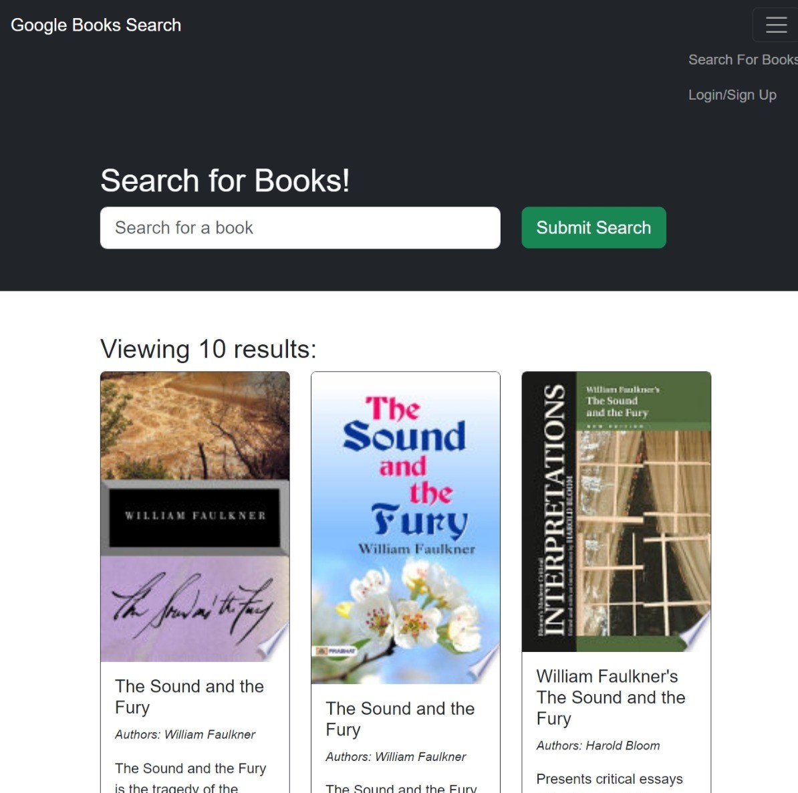
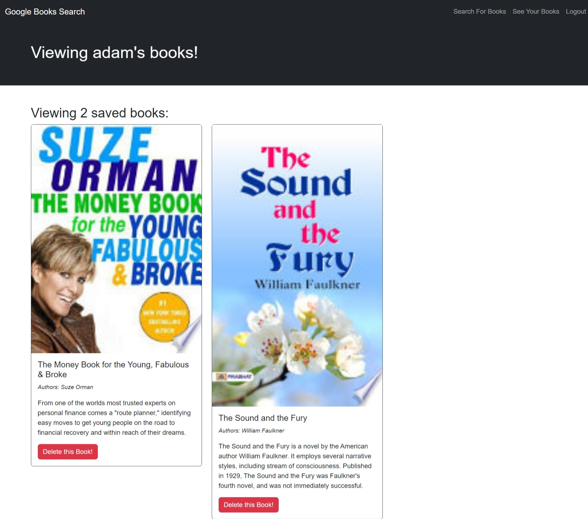

# Book Search

Google Book Search Engine Built with a GraphQL API build with Apollo Server.

Link to site: [https://whispering-reaches-16189-192d0bb9acf7.herokuapp.com/](https://whispering-reaches-16189-192d0bb9acf7.herokuapp.com/)

## Usage

Upon entering the site, the user is directed to the homepage. On the homepage, users are able to search for a book using the searchbar, and are also able to login or sign up using the link on the top right.

When a user is signed in, they are able to save searched books.  They are able to view a list of all their saved books, and can remove a book from that list by clicking on the Remove button.